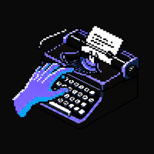
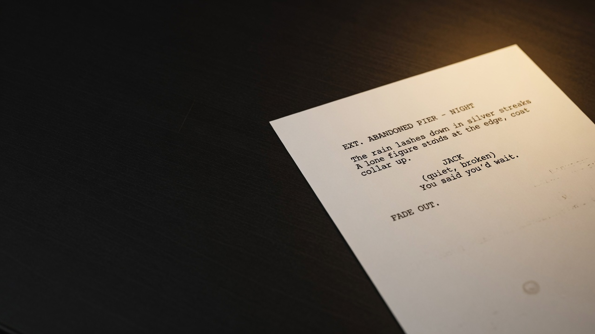
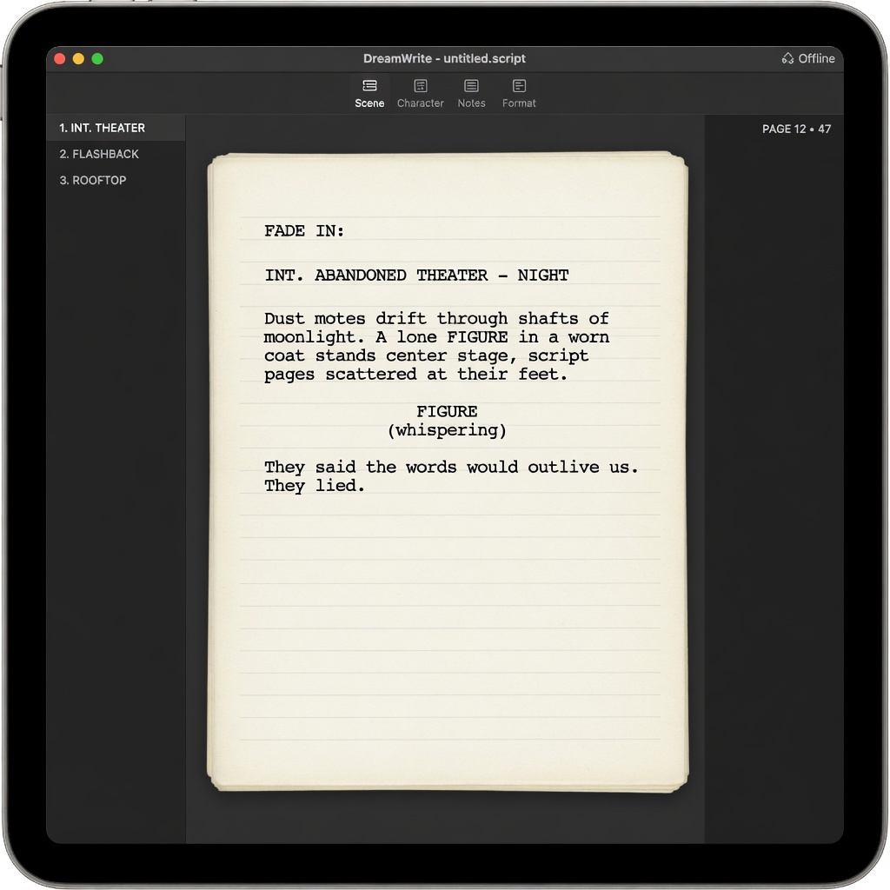

<p align="center">
  
</p>

<h1 align="center">DreamWrite</h1>

<p align="center">
  <strong>Offline ink-and-paper screenwriting.</strong><br />
  Script · Board · Timeline — one document, no accounts.
</p>

<p align="center">
  <a href="https://github.com/liminallyspaced/dreamwrite/releases/latest"></a>
  <a href="LICENSE"></a>
  <a href="https://github.com/liminallyspaced/dreamwrite/actions"></a>
  
</p>

<p align="center">
  <a href="https://github.com/liminallyspaced/dreamwrite/releases/latest"><strong>⬇ Download latest release</strong></a>
  ·
  <a href="#install">Install</a>
  ·
  <a href="#features">Features</a>
  ·
  <a href="#develop">Develop</a>
</p>

---

<p align="center">
  
</p>

> **One entity, three views.** A scene *is* a script block *and* a board card *and* a timeline event.

| | |
|:--|:--|
| **Author** | [Nicholas Siegel](https://github.com/liminallyspaced) (`liminallyspaced`) |
| **Stack** | Electron 33 · vanilla JS · esbuild · vitest |
| **Platforms** | Windows x64 (installer + portable) · macOS arm64/x64 (DMG via CI/Mac) |
| **License** | MIT |

---

## Why DreamWrite

Screenwriters juggle **format tools**, **boards**, and **timelines** — three apps, three models of “what a scene is,” plus logins and subscriptions.

DreamWrite is a single **offline** desktop workspace:

- Industry-style pagination for screen **and** PDF  
- Full undo (command stack — prose is never silently dropped)  
- Board + timeline linked to the same script entities  
- No accounts, no telemetry, no network by default  

---

## Features

| Area | What you get |
|:-----|:-------------|
| **Script** | Courier Prime · 54 lines/page · Tab/Enter flow · CONT'D/MORE · multi-page paper stack · PDF |
| **Pagination** | **One** engine for layout, stats, and export |
| **Undo** | Full command history · typing merges · Ctrl/Cmd+Z |
| **Marking wheel** | Middle-mouse hold · ≤8 contextual items · flick to mark · drag to pan |
| **Timeline** | Integer ticks · bookend eras · lane packing · scene sync · jump to script |
| **Board** | Notes · scene-cards · nested boards · templates · image assets · tables |
| **Search / Bible** | Offline full-text · characters & locations from script |
| **Projects** | Fountain in/out · folder packages + content-addressed assets · atomic saves |

### Not included (on purpose)

| Non-goal | Why |
|:---------|:----|
| Real-time collab | Needs accounts/server — breaks the premise |
| Stock photos by default | Network is not the default |
| Web clipper as core | Separate product if ever |

---

## Product direction

<p align="center">
  
</p>

Monochrome carbon desk · clean white paper · **Courier only on the page** · IBM Plex / Source Serif for chrome.

---

## Install

### Windows

From **[Releases](https://github.com/liminallyspaced/dreamwrite/releases/latest)**:

| File | Use |
|:-----|:----|
| **`DreamWrite-Setup-*.exe`** | Full installer (Start Menu + Desktop shortcuts) |
| **`DreamWrite-Portable-*.exe`** | No install — run anywhere |

> SmartScreen may warn on unsigned builds → **More info** → **Run anyway** if you trust the source.

### macOS

Download the **`.dmg`** for your chip (`arm64` or `x64`) from Releases (when published), or build on a Mac:

```bash
npm install && bash scripts/pack-mac.sh
```

First open if unsigned: right-click → **Open**.

Projects live in **`Documents/DreamWrite/`**.

---

## Develop

```bash
git clone https://github.com/liminallyspaced/dreamwrite.git
cd dreamwrite
npm install
npm start
```

```bash
npm test                 # unit tests
npm run test:smoke       # Electron smoke (Windows)
npm run pack:win         # Setup + Portable → dist/
npm run deploy:desktop   # pack + clean Desktop (archive older builds)
```

| Command | Output |
|:--------|:-------|
| `npm run pack:win` | `DreamWrite-Setup-<ver>.exe` + `DreamWrite-Portable-<ver>.exe` |
| `npm run pack:mac` | DMG + ZIP (**must run on macOS**) |
| `npm run deploy:desktop` | Refreshes Desktop; archives old DreamWrite\* copies |

Tag a release to trigger CI builds:

```bash
git tag v1.2.1
git push origin v1.2.1
```

---

## Architecture

```
src/core/      pure modules — store, pagination, board, timeline, format-v2
src/views/     script / board / timeline UI
src/app.js     renderer shell
main.js        Electron main — dialogs, atomic writes, path sandbox
docs/          ADRs + specs
website/       README images + optional static landing assets
```

**Invariants:** offline · `core/` has no DOM · mutations via command stack · one pagination engine · never silently delete prose · never migrate projects in place.

---

## Verification

- **177** unit tests (vitest)  
- Electron smoke (load · type · autosave)  
- Windows **NSIS** installer + portable via electron-builder  

---

## Keyboard

| Shortcut | Action |
|:---------|:-------|
| Tab / Enter | Cycle element / new block |
| Ctrl/Cmd+1…7 | Element type |
| Ctrl/Cmd+Z | Undo |
| Ctrl/Cmd+S / O / N | Save / Open / New |
| Ctrl/Cmd+F | Find |
| Ctrl/Cmd+P | Export PDF |
| F11 | Focus mode |
| MMB | Wheel / mark / pan |

---

## License

MIT — see [LICENSE](LICENSE).

Not affiliated with Final Draft, WriterDuet, Celtx, Milanote, or Aeon Timeline.

<p align="center">
  
  <br />
  <sub>DreamWrite · liminallyspaced</sub>
</p>
